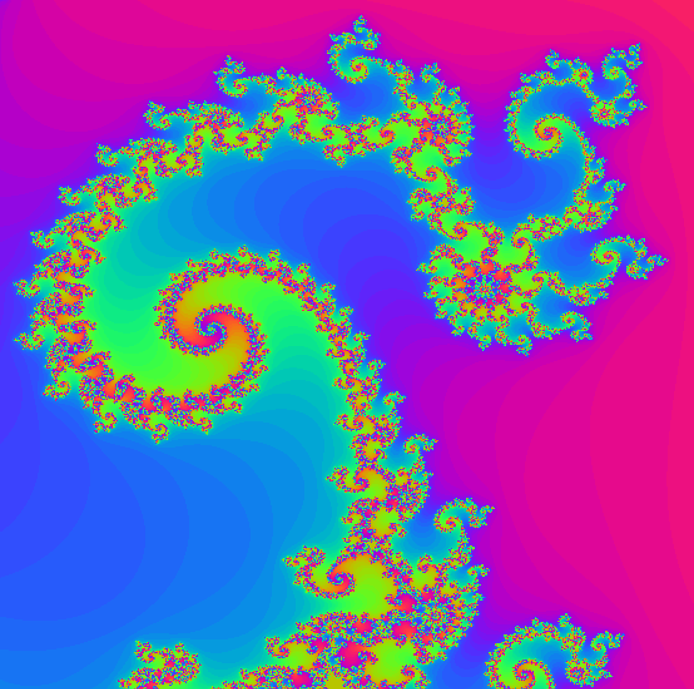
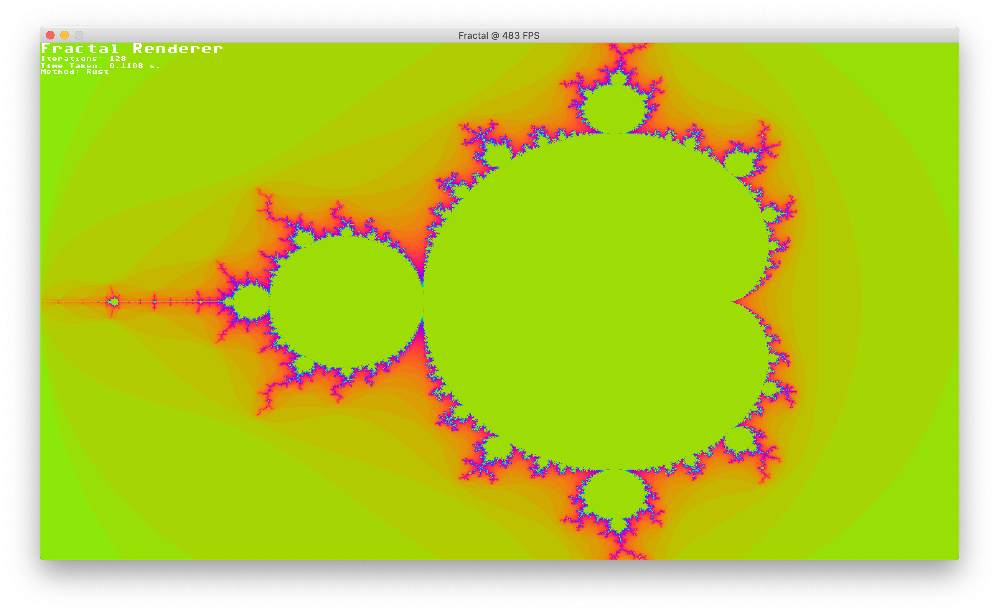

# Fractal

This is a fractal renderer implemented in Python using the pixel fiddling tools provided by `pxng`. The Python solution is extremely slow so a binding to a Rust version of the calculation has been integrated. This improves the rendering time approximately 100 times.



## Building
Rust needs to be installed and a fairly new version of Python 3. Clone the repository and run the follow commands.

```
pip install pxng
make release
```

`make release` runs `cargo build` and copies the resulting dynamic library file into the Python package.

## Running
From the command line run the application by calling `python fractal.py`. 


The application will start in Rust mode and show the Mandelbrot fractal. Press __2__ to switch to calculating the fractal using Python. Press __1__ to get back to Rust.

Point the mouse at any point and scroll your mouse wheel to zoom into (or out of) the fractal. You can also use __z__ and __x__ for this. Hold the __left__ mouse button and drag the mouse to pan around. Press __j__ and __i__ to decrease or increase the number of iterations. As you zoom in it is necessary to increase the number of iterations. Reset to the initial view by pressing __space__.    

## Credits
- OneLoneCoder and his YouTube movies (especially the one about fractals).